<p align="center">
  <a href="" rel="noopener">
 </a>
</p>

<h3 align="center">Proyecto: Safe Move</h3>

---

<p align="center"> Guarda y registra alumnos en caso de una emergencia
    <br> 
</p>

## 📝 Table of Contents
- [About](#about)
- [Getting Started](#getting_started)
- [Deployment](#deployment)
- [Documentation](#documentation)

## 🧐 About <a name = "about"></a>
Es una aplicación web hecha en Angular 13, que ayuda a los alumnos y profesores, que estén registrados y se pueda saber quién está a salvo.

### Initial View
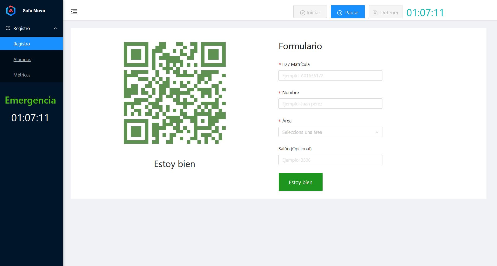</a>
/welcome
### List of students
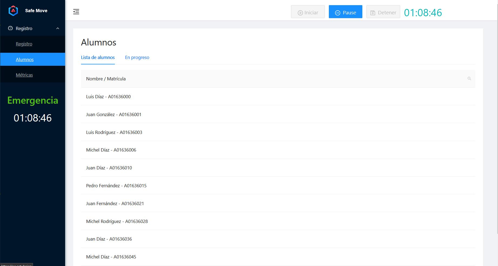</a>
/students
### Metrics
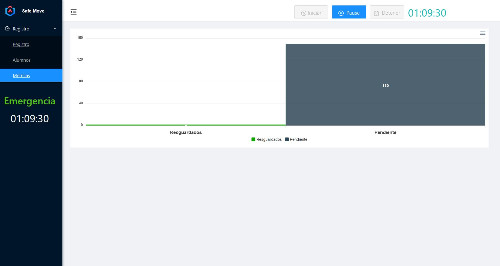</a>
/dashboard
## 🏁 Getting Started <a name = "getting_started"></a>
Clonar el repositorio, tener instalada la última versión de Angular CLI, y un navegador como Chrome.

### Prerequisites
Angular CLI: 13.3.9

Node: 16.14.2

Package Manager: npm 8.5.0

OS: win32 x64

```
npm i @angular/cli
```

### Installing (Local)
Clonar el repositorio

Descargar las librerias del proyecto

```
npm i --force
```

Correr el proyecto en local

```
ng serve -o
```

## 🚀 Deployment <a name = "deployment"></a>
Clonar el repositorio

Descargar las librerias del proyecto

```
npm i --force
```

Crear la carpeta ./dist del proyecto

```
ng build --configuration production
```

Correr y tener configurado el archivo server.js

```
node server.js
```


## 🗎 Documentation <a name = "documentation"></a>
La aplicación usa ant-design como principal framework de customización y diseño de componentes (https://ng.ant.design/docs/introduce/en), y es código abierto. También usado por Alibaba e instancias de Apache.
### Dependencies
Librerías necesarias al momento del lanzamiento de la última **versión 1.0.0**

```
    @angular/animations : ~13.3.0
    @angular/common : ~13.3.0
    @angular/compiler : ~13.3.0
    @angular/core : ~13.3.0
    @angular/forms : ~13.3.0
    @angular/localize : ~13.3.0
    @angular/platform-browser : ~13.3.0
    @angular/platform-browser-dynamic : ~13.3.0
    @angular/router : ~13.3.0
    @ng-bootstrap/ng-bootstrap : ^12.1.2
    @popperjs/core : ^2.10.2
    angularx-qrcode : ^13.0.15
    apexcharts : ^3.35.5
    body-parser : ^1.20.1
    bootstrap : ^5.2.0
    clone : ^2.1.2
    compression : ^1.7.4
    cors : ^2.8.5
    dotenv : ^16.0.3
    express : ^4.18.2
    express-session : ^1.17.3
    fs : ^0.0.1-security
    https : ^1.0.0
    ng-apexcharts : ^1.7.1
    ng-zorro-antd : ^13.4.0
    ngx-mask : 13.1.15
    path : ^0.12.7
    rxjs : ~7.5.0
    tslib : ^2.3.0
    zone.js : ~0.11.4

```

### Modules and more
#### AppModule
 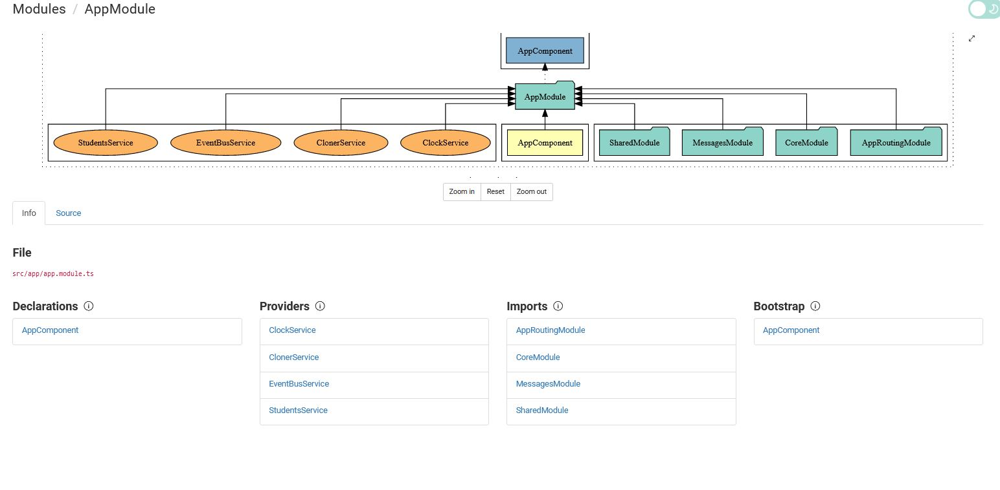</a>
#### Core module
 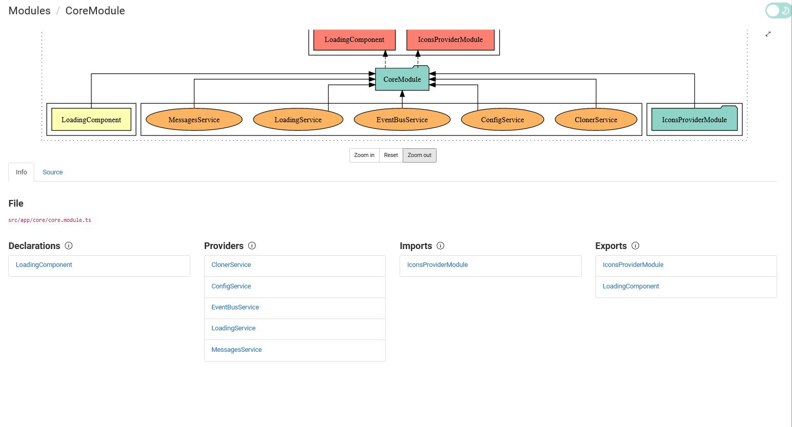</a>
#### Dashboard module
 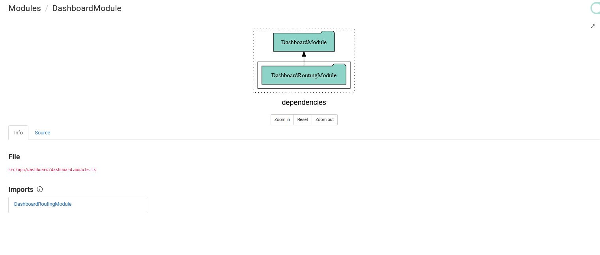</a>
#### Form status module
 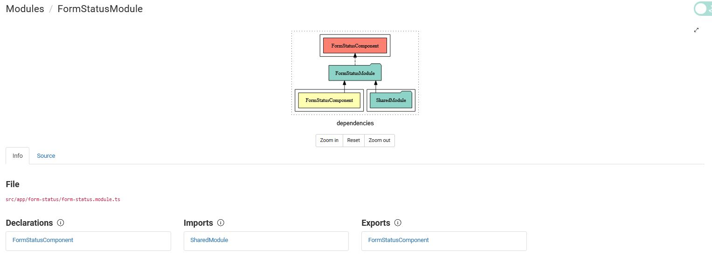</a>
#### Messages module
 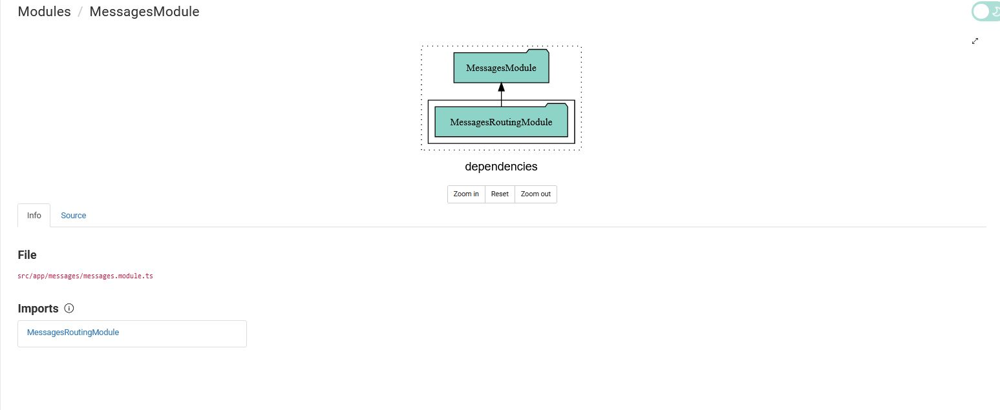</a>
#### QR Module
 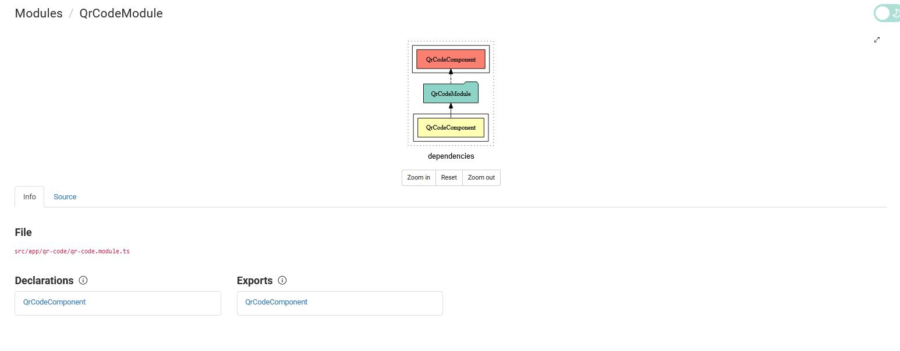</a>
#### Shared Module
 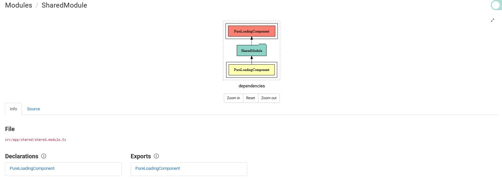</a>
#### Students module
 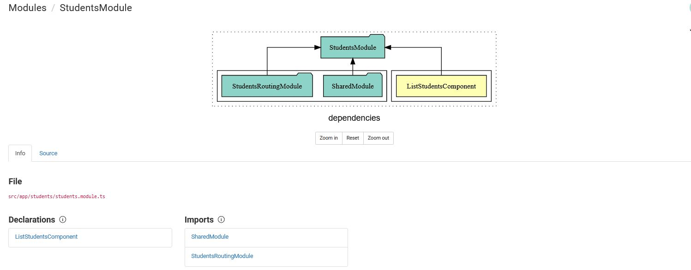</a>
#### Welcome module
 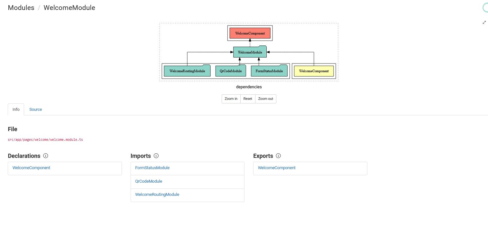</a>

## Routing
#### Links and structure
 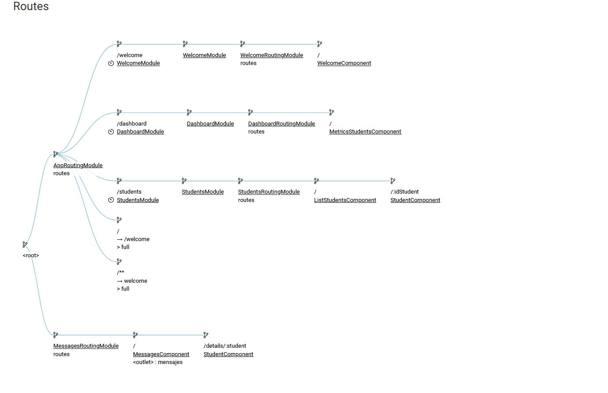</a>


## 🎈 Usage <a name="usage"></a>
Si se quiere desplegar en un servidor como linux, es necesario desplegarlo en un motor de plantillas como la función ofrecida por express "express.static", a partir de correr una instancia de node.


## ⛏️ Built Using <a name = "built_using"></a>
- [Angular](https://angular.io/) - Database
- [Express](https://expressjs.com/) - Server Framework
- [NodeJs](https://nodejs.org/en/) - Server Environment
- [NgZorro](https://ng.ant.design/docs/introduce/en) - Ant design framework frontend

## ✍️ Authors <a name = "authors"></a>
- [@lvm3632](https://github.com/lvm3632) - Miche Lujano 

- [@Luis99B](https://github.com/Luis99B) - Luis Bodart 

- [@CristopherIC](https://github.com/Luis99B) - Cristopher Ibarra

